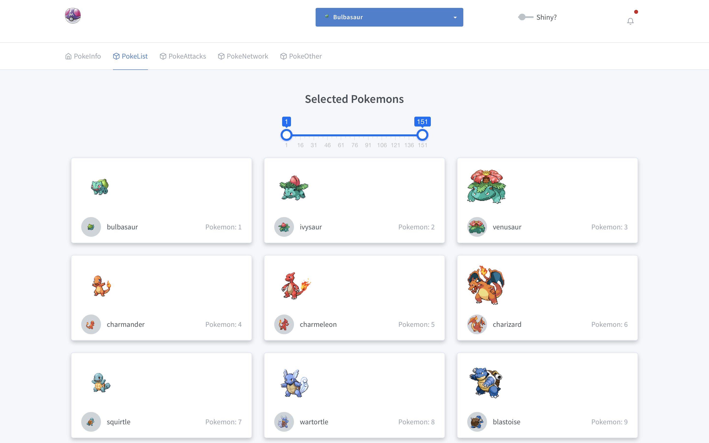
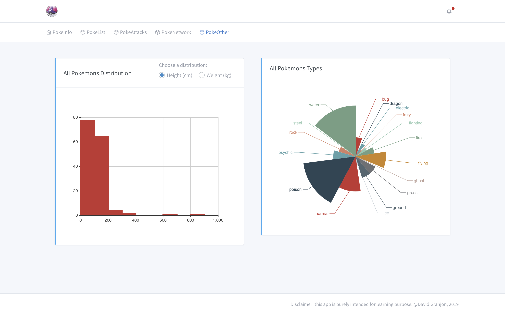

# shinyMons

> shiny app for pokemons

## Purpose of this App:
This app was designed for two reasons:

- propose something original for the upcoming [shiny contest](https://blog.rstudio.com/2019/01/07/first-shiny-contest/) event
- serve as a gallery for the RinteRface [tablerDash](https://github.com/RinteRface/tablerDash) 
dashboard template

## Original Data
The original data are taken from the amazing [pokeApi](https://pokeapi.co). However, 
I did not use any GET request. Instead, I built my own data from what I found relevant in the API.
Moreover, I chose to deal only with the first 151 pokemons (because I played with them as a child).
Such a restriction is actually not as straightforward as it seems to handle, since each element need to
belong to the first pokemon generation (while the API provides unfiltered data). There are features 
that exist now but not in the first games (namely red/blue):

- eggs
- special objects
- day/night cycle
- mega evolutions
- ...

## App skeleton
This app is packaged into 11 shiny modules that tightly interact together to pass useful informations,
such as the currently selected pokemon. All outputs are mainly generated with the excellents  [echarts4r](https://github.com/JohnCoene/echarts4r) and [visNetwork](https://datastorm-open.github.io/visNetwork/).

## Interface
This app is built on top of the brand new Bootstrap 4 [tablerDash](https://github.com/RinteRface/tablerDash) template. Furthermore, it 
includes the new pushbar.js library implementation by [John Coene](https://github.com/JohnCoene/pushbar). Combined together, this allows to develop clean templates,
especially for mobile devices. 

## Screenshots

### Main Panel: informations about a given pokemon
 

 
 

### Gallery Panel: Display all 151 pokemons
 

 
 

### Attacks Panel: informations about attacks
 

 
 

### Network Panel: visualize evolutions and more
 

 
 

### Others Panel: other stats
 

 
 

## Further projects
- Build a clean database for the first generation of pokemons
- Develop a fight system based on pokemon's stats
