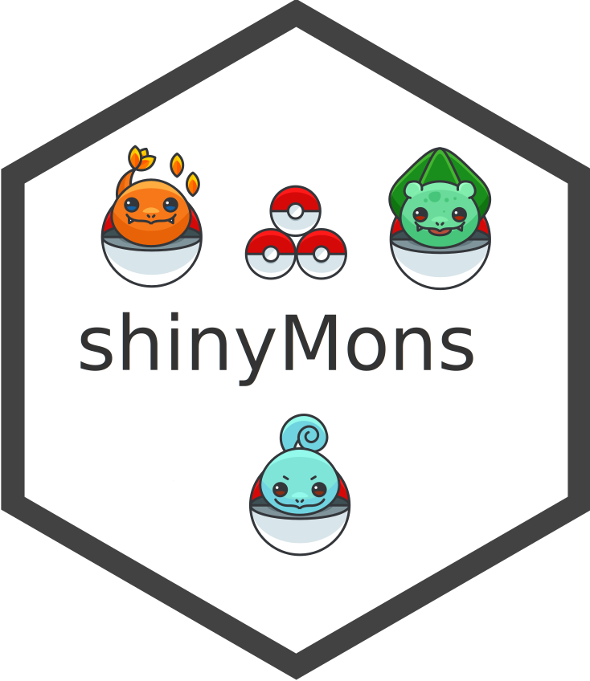

<!-- README.md is generated from README.Rmd. Please edit that file -->

# shinyMons 

<!-- badges: start -->

<!-- badges: end -->

> shiny app for pokemons

## Purpose of this App:

This app was designed for two reasons:

- propose something original for the upcoming [shiny
  contest](https://blog.rstudio.com/2019/01/07/first-shiny-contest/)
  event
- serve as a gallery for the RinteRface
  [tablerDash](https://github.com/RinteRface/tablerDash) dashboard
  template

<iframe class="html-fill-item" src="https://shinylive.io/r/app/#code=NobwRAdghgtgpmAXGKAHVA6ASmANGAYwHsIAXOMpMAdzgCMAnRRASwgGdSoAbbgCgA6EAATCBYdgAs2ATwCyJduNxDRDOKiLthAXmEFBI0WLCTSpVO0QB6awzbkGAMygE4GAOYtSkgK50MFiI7BzhnVzgAWmoodhhIggYoCGtlVWNxMwsrW3VNDAZo2JgMIgYPcXSASiEaiCFuFkYoBhk+KVk6xubW9ukIGQArdi6mpN6uOm4wgBFYyVGeto6BgHUWABMPOFIRhrGW5f6ZAFEnJzgCXcXxttRfKToWm8O+2QUOF96Y7zC6oUm0wYAH0NhptAAeSLCMwwbikIhEbhWRBONgbGYaChgiAEFhwdh8QGzeYABSg2z4VX+EF8LGEUOETl8uNIQQgfHUAEdfATSFVhCB0lwPAAZFicQzGYQbFgANyl0v03Fi2j04mIZCgbDCkSc3DpG2EMBkkQArGkjNLNABrODA9hwaZXYF0wQSJ2XUjiKoqK3GWUK9JK5Wq3QmBhEajG00WvDBpWBxUh0QEFXsNUmYjcSLcDyRADM+iRkRgG0iADZLSnjLb7WwnFpXSx3Q2tD6-TXRHWHVxds33ZwoLsfcBgABGAC6k87XZ73CIBGH7PYA-EC6XbJIPoT0t9u4D8uTKbTYfVhBLefNxZzZcr1bnRDtveHq7d4iHI7AVWABgATLgwgFlUM4HtaT72nAcpImuYBQUiHZgcI+7+tKSZIam6aZhql75gALDepbluOf4PjWPakDIqAErBlHUUo35IXUIYoSGPYwEQco0e+YAcVxDHMcYrHGA8cCrNqjhUrOog-I4ADKkhRgA8hAopEFAGx8LC3DhiK4qSuwqBsMCLiyhAHjAniDBpgSUkmGpGlsB4wgYK5PrCaIxIgmCljVEIAC+QhCI6DBcQwDLQsyrLsnwbD3KQgFEL4FjJYBjoZuyApCkYslhMC0hglS6ShRFwjqK4bJcQAajwvKEhAOzUGUNoOp6VxwEaegAHIAKqiqKgkAMTGtqIgcRsvjTMIfAbMOUCCTAo2lT2jrOqQrWhWEx4fm13rxv6q1eh14blVc8pwHw2UhqFAAkDWkE1DAtYd7UbAm-mCTSojDW22jjZNcDpD2v0bWF21gL9ZHCC95CdSNbA3Stu3SdDxzhotCMSg6xx+UYw2fn9RATdMQMQS+-YhWDH59gxaW7cdegYxAiNkzDQ3CHRBLGkTANKEYFFUTRlNbeInO09D9Nw0zLPPmz6TDXxXP-ST-Nk4rq7Cww7rq8oEtrQz8PM0ja3sxuy7bqrz5m1uHCgyLYDW+yuswwb0vG16X3CMN8EGjbhPE4DRg+8CSWkMtZPB5r4M+1DLtS6NMv2jDKMrDI6MJ1jqe4+kRB0MLJxcWQfDB6HN1x3ZV3GLd92Pc9kulbEGC0vA9gGCXyVl5LVKCR9AVBRwxwAILoHwdJ05tDB1GA-mTkAA" height="700" width="100%" style="border: 1px solid rgba(0,0,0,0.175); border-radius: .375rem;" allowfullscreen="" allow="autoplay" data-external="1"></iframe>

<bslib-tooltip placement="auto" bsOptions="[]" data-require-bs-version="5" data-require-bs-caller="tooltip()">
<template>Expand</template>
<button aria-expanded="false" aria-label="Expand card" class="bslib-full-screen-enter badge rounded-pill"><svg xmlns="http://www.w3.org/2000/svg" viewBox="0 0 24 24" style="height:1em;width:1em;fill:currentColor;" aria-hidden="true" role="img"><path d="M20 5C20 4.4 19.6 4 19 4H13C12.4 4 12 3.6 12 3C12 2.4 12.4 2 13 2H21C21.6 2 22 2.4 22 3V11C22 11.6 21.6 12 21 12C20.4 12 20 11.6 20 11V5ZM4 19C4 19.6 4.4 20 5 20H11C11.6 20 12 20.4 12 21C12 21.6 11.6 22 11 22H3C2.4 22 2 21.6 2 21V13C2 12.4 2.4 12 3 12C3.6 12 4 12.4 4 13V19Z"/></svg></button>
</bslib-tooltip>

## Original Data

The original data are taken from the amazing
[pokeApi](https://pokeapi.co). I built my own data from what I found
relevant in the API (see `data-waw` folder). Moreover, I chose to deal
only with the first 151 pokemons (because I played with them as a
child). Such a restriction is actually not as straightforward as it
seems to handle, since each element need to belong to the first pokemon
generation (while the API provides unfiltered data). There are features
that exist now but not in the first games (namely red/blue):

- eggs
- special objects
- day/night cycle
- mega evolutions
- …

## App skeleton

This app is packaged into 11 shiny modules that tightly interact
together to pass useful informations, such as the currently selected
pokemon. All outputs are mainly generated with the excellents
[echarts4r](https://github.com/JohnCoene/echarts4r) and
[visNetwork](https://datastorm-open.github.io/visNetwork/).

## Interface

This app is built on top of the Bootstrap 4
[tablerDash](https://github.com/RinteRface/tablerDash) template.
Furthermore, it includes the pushbar.js library implementation by [John
Coene](https://github.com/JohnCoene/pushbar). Combined together, this
allows to develop clean templates, especially for mobile devices.

## Further projects

- Develop a fight system based on pokemon’s stats
